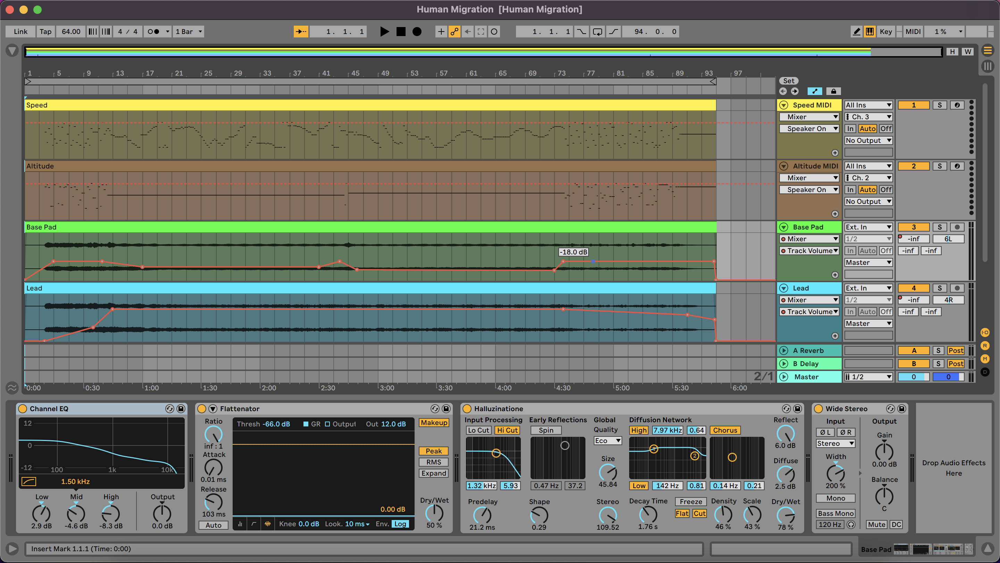

# A New Life - Single

**A New Life** is a music single that consists of 2 tracks:

- Human Migration. It uses aircraft altitude and speed data to generate the melody.
- Tallinn In December. It uses real-time hourly weather forecast data of Tallinn generate the melody.

The JavaScript code will generate MIDI data and send it to DAW (Digital Audio Workstation) in real-time to control my Korg Kross 2 synthesizer. After that, the synthesizer will send back the audio to the DAW, and the DAW will record it as an audio track.

You can read the story of the music on my blog: [A New Life](https://www.asepbagja.com/music/a-new-life-singles). 😄

### Listen the music at

- [Spotify](https://open.spotify.com/album/1f5KJowOd4hOtrEN7Tp8ET?si=fMQcS8BMQ3iJEX2hAEFfmA)
- [Apple Music](https://music.apple.com/ee/album/a-new-life-single/1604685896)
- [YouTube Music](https://music.youtube.com/playlist?list=OLAK5uy_nWXjf6QmZYjtgZQn9vggBhEObtQ3HUvDk&feature=share)
- Tidal
- deezer
- iHeartRadio
- pandora
- Facebook and Instagram
- TikTok

